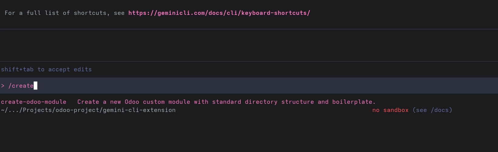
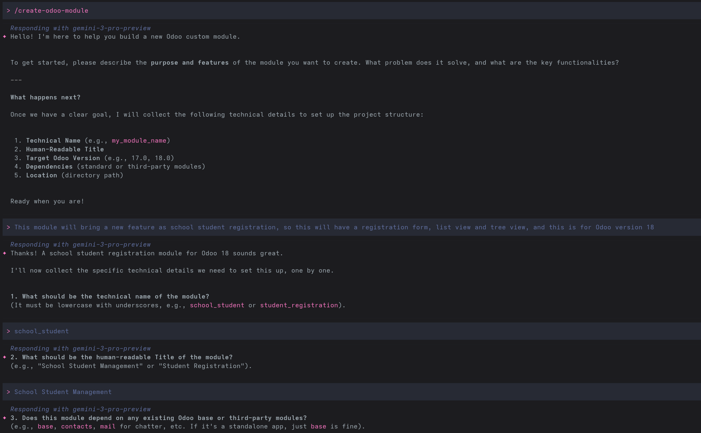

# Google Gemini CLI Odoo Module Generator Extension

This repository provides a custom command extension for the [Gemini CLI](https://geminicli.com) (or compatible Gemini terminal clients) that behaves as an autonomous agentic scaffold tool for Odoo development.

Instead of writing `__manifest__.py` and folders by hand, you can invoke this command and have Gemini automatically reason about your requirements, write a detailed Markdown design document, scaffold the entire directory structure, and scaffold out the model, view, security, and wizard directories.




## Features

- **Interactive Requirements Gathering**: The agent asks you clarifying questions about the technical name, title, version, and dependencies of the new module.
- **Design Document Generation**: Automatically writes a `specs/DESIGN.md` explicitly detailing the inheritance model, UI/UX architecture, and security strategy before touching any code.
- **Implementation Plan**: Creates a checklist-based `specs/IMPLEMENTATION.md` so you can follow the engine's step-by-step scaffolding process.
- **Automatic Scaffolding**: Uses its tools to actually execute `mkdir` and create `__init__.py`, `__manifest__.py`, and all relevant boilerplate.

## Installation

This extension can be installed directly from this Git repository or via the Gemini Extension Gallery if it has been indexed.

### Option 1: Install via Gemini CLI (Recommended)

You can install this extension directly using the Gemini CLI `extensions install` command. The CLI will download the latest version from the main branch.

```bash
gemini extensions install https://github.com/jeevanism/Gemini-Odoo-Module-Generator
```

### Option 2: Local Project Installation (Manual)

If you only want this command available when you are inside a specific Odoo project repository, you can copy the `commands` directory into that project's `.gemini` directory.

```bash
# Navigate to your Odoo project root
cd /path/to/your/odoo/project
mkdir -p .gemini/
# Copy the commands folder into the project's .gemini folder
cp -r /path/to/this/repo/commands .gemini/
```

## Usage

Once installed, simply open your Gemini command line interface and invoke the command:

```text
/create-odoo-module
```

The assistant will begin interviewing you about your module specifications. Relax, answer its questions, and review the design document when prompted!

## Customizing

You can easily modify how the Odoo developer agent behaves by editing the prompt inside `commands/create-odoo-module.toml`. Feel free to adjust the template to strictly follow your own organization's Odoo guidelines or OCA standards.
